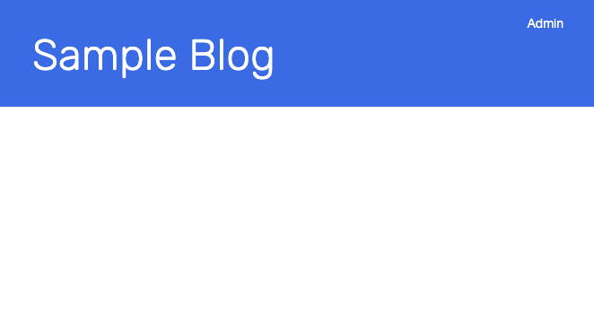
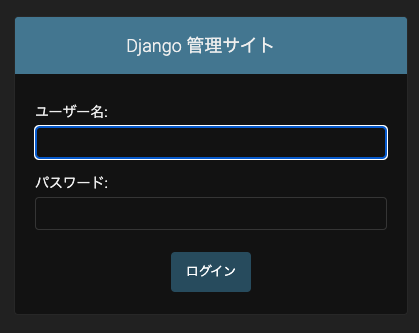
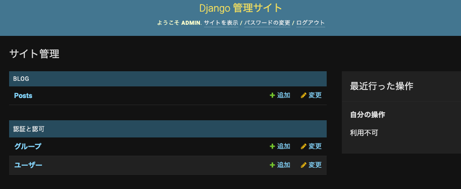
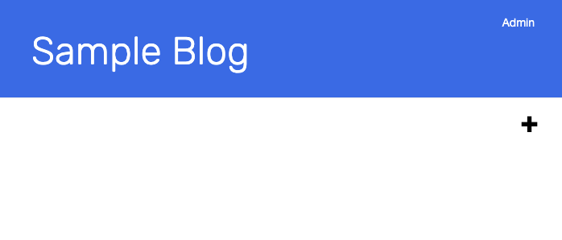
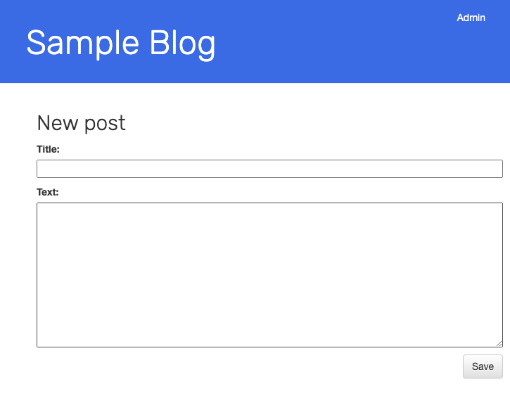
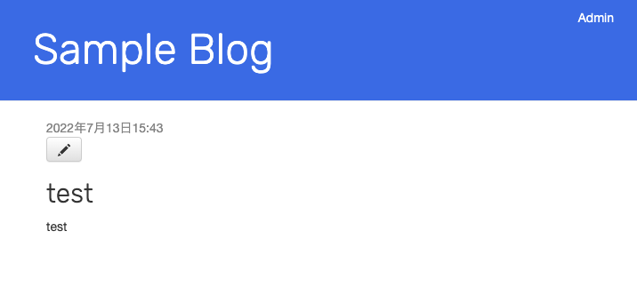
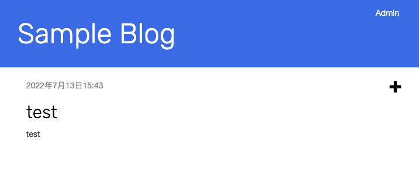

# はじめに
このアプリケーションはローカル端末のPodman上で動作するサンプルブログです。

※サンプルアプリは[Django Girlsのチュートリアル](https://tutorial.djangogirls.org/ja/)をベースに多少編集を施したものになります。

ここではアプリケーションのデプロイ手順と操作方法をまとめます。

# 前提条件
* Podman 5.3.0


# デプロイ手順
Git cloneします。
```
git clone https://github.com/skitamura7446/sample-blog-podman.git
cd sample-blog-podman
```


Djangoのコンテナをビルドします。
```
podman build -t django ./docker/django
```

Podman Networkを作成します。
```
podman network create webnet
```

RedisとMySQLのコンテナをデプロイします。
```
podman run -d --name mysql --network webnet -e MYSQL_ROOT_PASSWORD=sampleblog -e MYSQL_DATABASE=sampleblog -e MYSQL_USER=sampleblog -e MYSQL_PASSWORD=sampleblog mysql:8.0
podman run -d --name redis --network webnet -p 6379:6379 registry.redhat.io/rhel8/redis-6
```

それぞれのコンテナが正常に起動することを確認します。
```
podman logs --name mysql -f

...omit...
 ready for connections. Version: '8.0.40'  socket: '/var/run/mysqld/mysqld.sock'  port: 3306  MySQL Community Server - GPL.
```
```
podman logs --name redis -f

...omit...
Ready to accept connections
```

ビルドしたコンテナイメージをデプロイします。
```
podman run -d --name django --network webnet -p 8000:8000 django
```

ブラウザで"localhost:8000"にアクセスするとSample Blogが表示されます。



# 操作方法
アクセス時はまだブログ記事がないので、Adminにログインして記事を書きます。
右上のAdminをクリックすると、管理画面に遷移します。



以下の情報でログインすると、ブログの管理画面に遷移します。  
ユーザーID: `admin`  
パスワード: `admin`



画面上部の`サイトを表示`をクリックするとトップ画面に戻ります。  
画面右側に`＋`ボタンが表示されているのがわかります。



`＋`ボタンをクリックすると記事の登録画面に遷移します。



記事を書いて`Save`すると記事の画面に遷移します。
※鉛筆マークをクリックすると編集画面に遷移します。



`Sample Blog`をクリックしてトップページに遷移すると、登録した記事を確認できます。




Shield: [![CC BY-SA 4.0][cc-by-sa-shield]][cc-by-sa]

This work, "Sample Blog", is a derivative of "Django Girls Tutorial"  by [DjangoGirls](https://djangogirls.org/en/), used under [CC BY-SA](https://creativecommons.org/licenses/by-sa/4.0/).
"Sample Blog" is licensed under [CC BY-SA](https://creativecommons.org/licenses/by-sa/4.0/) by skitamura7446.

[![CC BY-SA 4.0][cc-by-sa-image]][cc-by-sa]

[cc-by-sa]: http://creativecommons.org/licenses/by-sa/4.0/
[cc-by-sa-image]: https://licensebuttons.net/l/by-sa/4.0/88x31.png
[cc-by-sa-shield]: https://img.shields.io/badge/License-CC%20BY--SA%204.0-lightgrey.svg
